## `> Sobre mí`

  

Diseño y automatizo sistemas que conectan **infraestructura, redes y software**. Me interesa convertir procesos manuales en plataformas repetibles, observables y fáciles de operar.

- 🔭 Explorando **Kubernetes**, arquitecturas cloud y automatización de infraestructura.
- ⚙️ Construyendo soluciones end-to-end con **Go, Java, JavaScript, PHP y SQL**.
- 🔌 Desarrollando **APIs RESTful**, servicios **gRPC** y flujos de integración.
- 📡 Analizando redes, tráfico y rendimiento para encontrar problemas antes de que escalen.
- 📚 Aprendiendo de forma continua y documentando lo que descubro.

## `> Stack tecnológico`

### Infraestructura, Cloud & DevOps

### Backend, scripting & web

### Datos, observabilidad & redes

 

## `> Radar 2026`

| Estado | Objetivo | Enfoque |
|:--:|---|---|
| 🟢 En progreso | **AWS Cloud Practitioner** | Fundamentos cloud, seguridad y costes |
| 🟢 En progreso | **Kubernetes — ruta CKA** | Administración y troubleshooting |
| 🟣 Siguiente | **CCNA** | Switching, routing y servicios IP |

## `> Métricas en tiempo real`

## `> Contribuciones en movimiento`

<picture>
  <source media="(prefers-color-scheme: dark)" srcset="./assets/snake/github-snake-dark.svg" />
  <source media="(prefers-color-scheme: light)" srcset="./assets/snake/github-snake.svg" />
  
</picture>

> La animación se regenera automáticamente cada día mediante GitHub Actions.

## `> Proyectos destacados`

<table>
  <tr>
    <td width="50%" valign="top">
      <h3 align="center">
        <a href="https://github.com/SX110903/llm_dating_app">💜 LLMatch — Dating App con IA</a>
      </h3>
      

        Matching inteligente, historias y chat en tiempo real. Frontend con Next.js y backend en Go con JWT, PostgreSQL/PostGIS, WebSocket y arquitectura limpia.
      

      

        
        
        
        
      

    </td>
    <td width="50%" valign="top">
      <h3 align="center">
        <a href="https://github.com/SX110903/php_project_web">🛡️ Secure App — Auth profesional</a>
      </h3>
      

        Autenticación y autorización con PHP, JWT, RBAC y una API REST. Incluye defensas CSRF/XSS/SQLi, rate limiting, Docker y CI/CD.
      

      

        
        
        
        
      

    </td>
  </tr>
</table>

## `> Conectemos`

Estoy abierto a colaborar en proyectos de **DevOps, networking, backend y automatización**.

«La tecnología evoluciona constantemente; nosotros también.»

 

<b>Automatizar hoy lo que harías manualmente mañana.</b>

